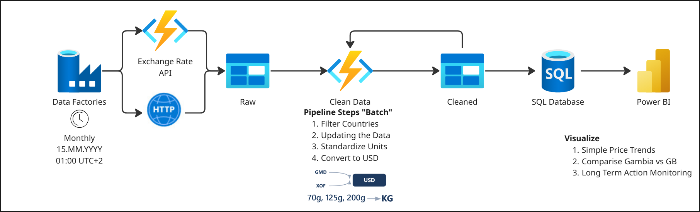
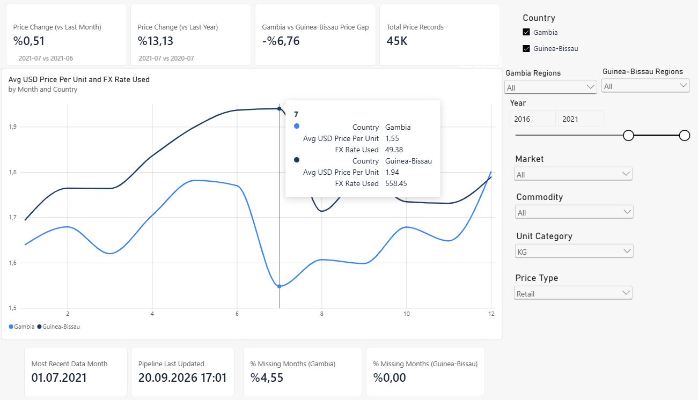
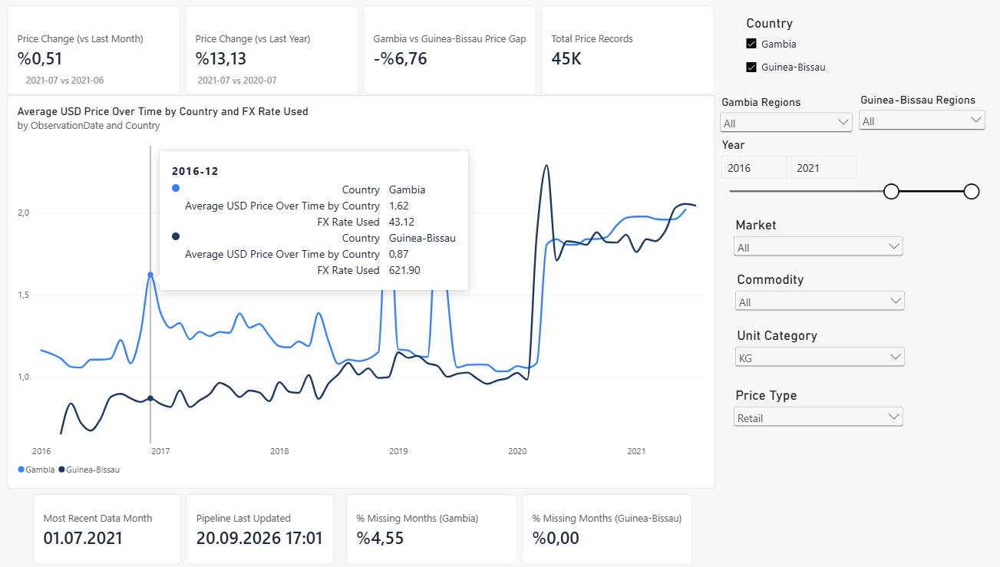
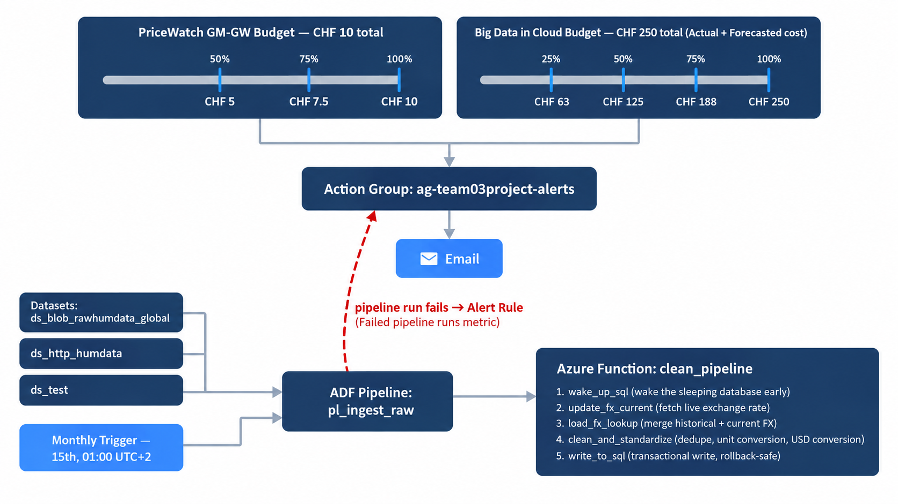
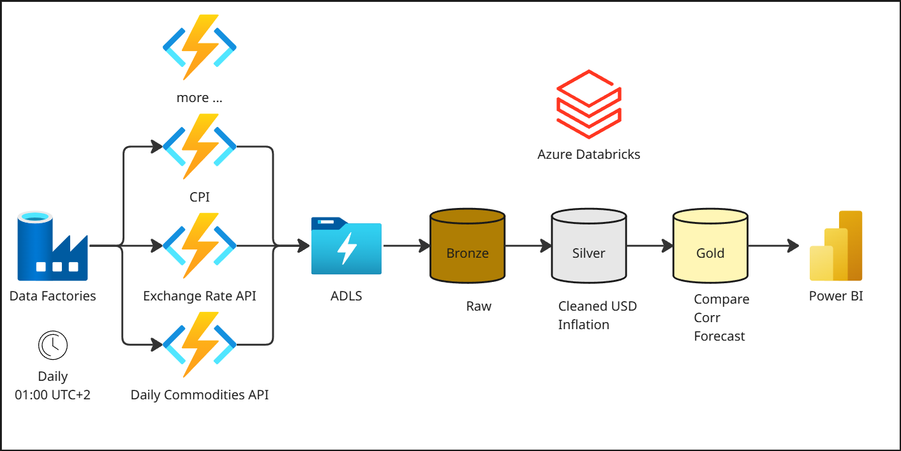
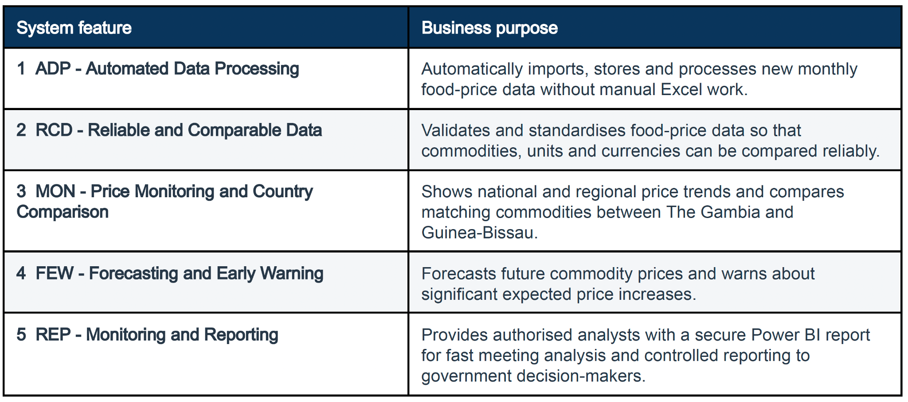

# Food Price Monitoring Pipeline on Azure

An automated, serverless data pipeline on Microsoft Azure that collects monthly food price data for **The Gambia** and **Guinea-Bissau**, cleans and standardizes it, converts all prices to USD, loads it into Azure SQL Database and visualizes it in Power BI.

Developed for the *Big Data in Cloud* module, MSc Applied Information and Data Science, HSLU (2026).

> **Note:** The Azure resources ran on a course subscription that has since been closed, so the live pipeline is no longer reachable. This repository keeps the code, configuration, database schema, exported data and a guide to rebuild the Power BI report.

## Architecture



| Step | Service | What happens |
|---|---|---|
| 1. Schedule | Azure Data Factory | Pipeline runs automatically on the 15th of every month |
| 2. Ingest | Data Factory + Blob Storage | The source CSV is downloaded and stored unchanged as `global_yyyyMMdd.csv` |
| 3. Transform | Azure Functions (Python) | Filter countries, remove duplicates, standardize units, convert to USD |
| 4. Load | Azure SQL Database | Curated table replaced inside a single transaction |
| 5. Report | Power BI | Two interactive dashboards |
| 6. Monitor | Azure Monitor | Email alerts on pipeline failures and budget thresholds |

## Transformation logic

All transformation code is in [`function_app.py`](function_app.py).

- **Country filter:** keeps only Gambia and Guinea-Bissau.
- **Duplicates:** identical records are kept once. Records with the same key but a different price or currency are excluded and logged with a reason.
- **Units:** 70 g, 125 g and 200 g packages are converted to price per KG. Litres and pieces stay in their own categories.
- **Currency:** GMD and XOF are converted to USD with the exchange rate of the observation's own month. Historical rates were loaded once; the current month's rate is fetched on every run from the Frankfurter API.
- **Safe load:** the SQL write runs in one transaction. If anything fails, it rolls back and the previous data stays intact.
- **Serverless database handling:** the function wakes the auto-paused database early and retries the connection on transient errors.

## Dashboards

**Seasonal price analysis:** average USD price by month of year; hovering shows the exchange rate used.



**Price trend over time:** the same metrics on a continuous timeline.



Filters: country, region, market, commodity, unit category, price type, year range.
KPI cards: month-over-month and year-over-year change, Gambia vs Guinea-Bissau price gap, record count, data freshness, share of missing months per country.

## Monitoring



Budget thresholds and failed pipeline runs both notify the same Action Group by email.

## More visuals

**Planned Phase 2:** a lakehouse on Azure Data Lake Storage and Databricks (bronze, silver, gold) with CPI and daily commodity prices as additional sources.



**System features** defined in the requirements specification:



## Repository structure

```
.
├── function_app.py   Azure Function: transformation and SQL load (Python)
├── host.json         Azure Functions host configuration
├── requirements.txt  Function dependencies
├── adf/              Data Factory pipeline (ARM template export)
├── sql/              Database schema
├── powerbi/          Power BI theme and rebuild guide (all DAX)
├── data/             Offline export of the pipeline outputs
├── scripts/          FX backfill and local export scripts
├── tests/            Unit tests for the transformation logic
└── docs/             Images, project documents, requirements traceability
```

## Project documents

- [`PriceShield_Gambia_MBR.pdf`](docs/project/PriceShield_Gambia_MBR.pdf) - final presentation: context, requirements, architecture, dashboards and service levels.
- [`PriceShield_Requirements.pdf`](docs/project/PriceShield_Requirements.pdf) - system features and functional requirements (the basis of the traceability table).
- [`PriceShield_Service_Level_Agreement.pdf`](docs/project/PriceShield_Service_Level_Agreement.pdf) - service scope, responsibilities, availability and support targets.
- [`PriceShield_Cost_Estimate.pdf`](docs/project/PriceShield_Cost_Estimate.pdf) - Azure pricing estimates for Phase 1 and Phase 2 and a comparison of dashboard tools.

## Run the tests

```bash
pip install -r requirements-dev.txt
pytest -q
```

## Data source

World Food Programme food prices, published on the [Humanitarian Data Exchange](https://data.humdata.org/dataset/wfp-food-prices). Exchange rates: [Frankfurter API](https://frankfurter.dev).

## Limitations and next steps

- Full reload each month suits the current volume; a much larger source would need incremental loading.
- Infrastructure was created in the Azure Portal; infrastructure as code (Bicep) would make it redeployable.
- Planned extension: Azure Data Lake Storage and Databricks for forecasting, with CPI and daily commodity prices as reference series.

Requirement coverage: [`docs/requirements_traceability.md`](docs/requirements_traceability.md).

To open the dashboards without Azure, see [`powerbi/OFFLINE_SETUP.md`](powerbi/OFFLINE_SETUP.md).
